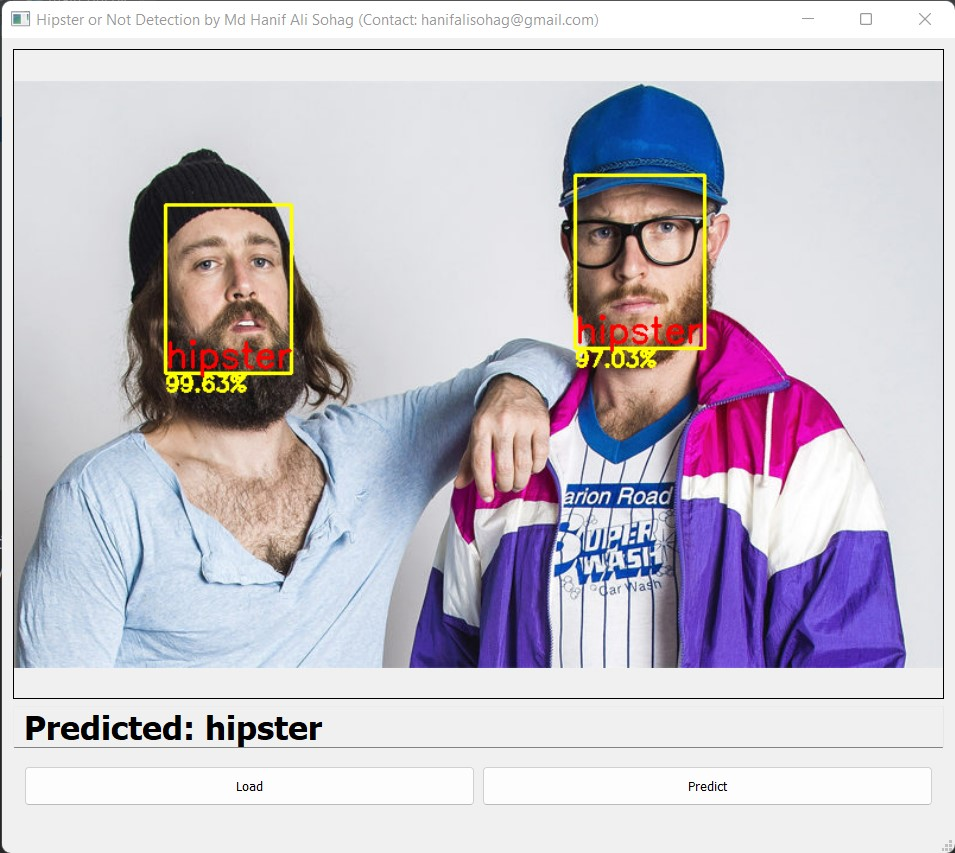
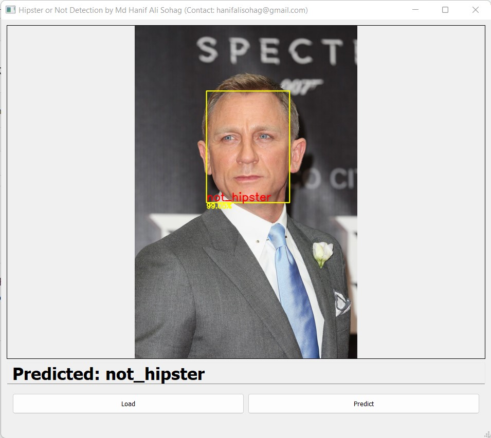

# Machine Learning Classification Desktop Application using PyQT5

This kind of software might be helpful in detecting peoples with a beard in different scenarios. The deep learning model took around 10 hours of time for training with 5K images (2.5K each). The model is built using the Tensorflow platform with Python programming language

## Download Model Files:
Link 1:
[Hipster and Not Hipster RESNET-50 Model](https://www.swisstransfer.com/d/ddddeebf-410d-4820-82b3-127f9ff47990)

Link 2:
[Hipster and Not Hipster RESNET-50 Model](https://wetransfer.com/downloads/44912abb0dc0d9de6b9085c91d48679a20211022022812/3af9e1)

Download the model file and then copy it to the **models** folder
## Results:
Hipster and Non-hipster GUI:

